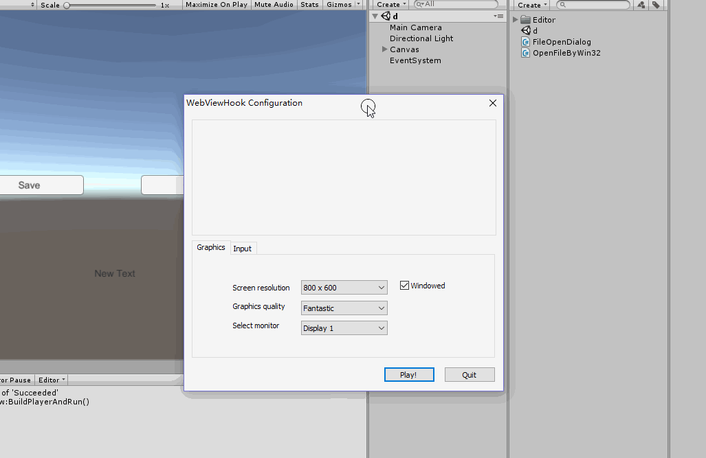

# UniFileOpenDialog
FileOpenDialog/ FileSaveDialog  For Untiy . With Topmost Fuction .

* The FileOpenDialog will never disappear when you hit unityplayer unexpectedly.
* And you can get the saved file's path now.

# Reference：
[Unity 3D OpenFileDialog / SaveFileDialog 如何置顶](https://www.jianshu.com/p/8cc34b2a7377)
